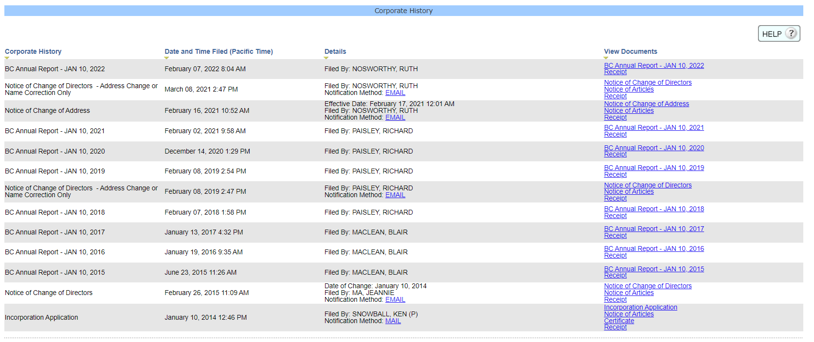
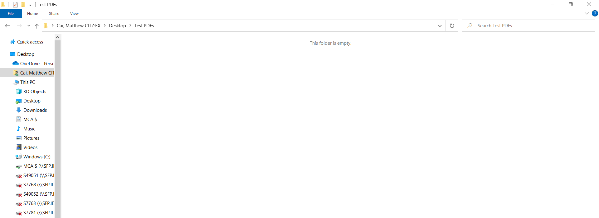
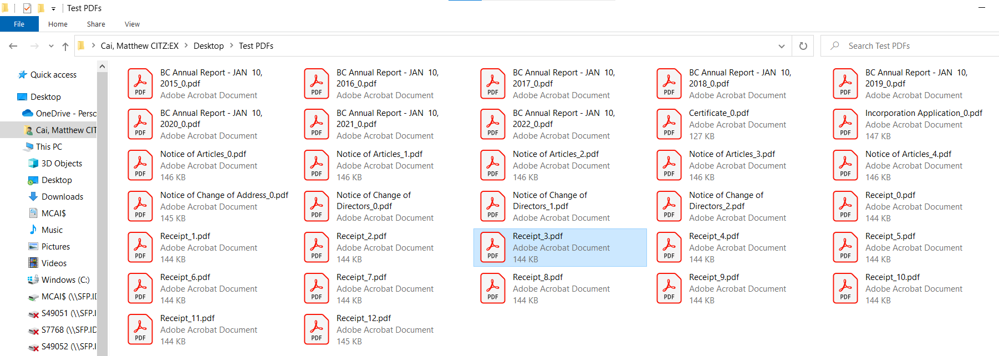
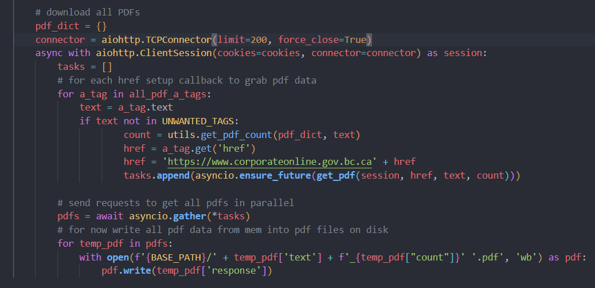

- Start Date: 2022-11-21
- Target Major Version: None
- Reference Issues: https://github.com/bcgov/entity/issues/14125
- Entity Issue: (leave this empty)
- Implementation PR: (leave this empty)

# Summary

## **idea:**
Each organization in COLIN has a filing history with multiple PDFs per filing. As COLIN becomes too cumbersome to work with and the transition to the modern app continues, there needs to be a way to migrate filing history of all organizations in in COLIN over to the modern system.

This approach will implement a screen scraper to retrieve all PDFs for each filing in an org's filing history and store them under a directory tree then send them into Doc Storage on the modern app. This approach is relatively lightweight and simple to implement compared to directly accessing Jasper and RMI, while achieving the same result with similar performance.

## **Background info:**

 COLIN follows a monolith architecture with COLIN UI connecting to COLIN which makes calls to 2 different report servers (Jasper and RMI) who then query the Oracle database for all the data needed to generate all the necessary PDFs for a filing dynamically. These PDFs are not saved (with some exceptions like dissolutions). 
 
 PDF generation for a an entire filing is handled by one of the report servers at a time. So one server generates all the PDFs for a type of filing. ie) RMI generates all the PDFs for annual filings while Jasper generates PDFs for most other filings. Both of these can be interacted with directly although Jasper is it's own external report server with documentation while RMI isn't it's own server and doesn't have documentation. Both of these have different different structures and different ways of interacting with them, but either way a Java app will most likely need to be developed to interact with both them. 

 Calling COLIN directly should be possible but it's unknown how. 
  


# Basic example
Example screen scraper that downloads all PDFs from a test org in COLIN built using Selenium, Beautiful Soup, and aiohttp libraries.

```python
import os
import aiohttp
import asyncio

from bs4 import BeautifulSoup as bs
from selenium import webdriver
from selenium.webdriver.common.by import By
from selenium.webdriver.support.ui import Select

import utils.utils as utils

BASE_URL = 'https://www.corporateonline.gov.bc.ca/corporateonline/colin/signon/start.do?action=login'
BASE_PATH = r"C:\Users\MCAI\Desktop\Test PDFs"
ORG_NUM = 'BC0990639'
UNWANTED_TAGS = ['EMAIL', 'MAIL']

async def get_pdf(session, href, text, count):
    async with session.get(href) as response:
        return {"response": await response.read(), "text": text, "count": count}

async def main():
    os.environ['PATH'] += r'\\SFP.IDIR.BCGOV\U177\MCAI$\Profile\Desktop\Documents\Chrome WebDriver'

    driver = webdriver.Chrome()

    driver.get(BASE_URL)
    driver.implicitly_wait(1)

    # find all log in elements 
    username = driver.find_element(By.NAME, 'user')
    password = driver.find_element(By.NAME, 'password')
    submit = driver.find_element(By.NAME, 'nextButton')
    type_dropdown = Select(driver.find_element(By.NAME, 'realmId'))

    # log in
    username.send_keys('mcai')
    password.send_keys('N0>{m8=6|2@o*2')
    type_dropdown.select_by_value('staff')
    submit.click()
    log_in_cookies = driver.get_cookies()

    # go to registry search
    registry_search = driver.find_element(By.XPATH, '//*[@id="servicesLeft"]/div/p[1]/a')
    registry_search.click()

    # input corpNum
    corp_num = driver.find_element(By.NAME, 'corpNum')
    corp_num.send_keys(ORG_NUM)
    submit = driver.find_element(By.NAME, 'nextButton')
    submit.click()

    cookies = {}
    for cookie in log_in_cookies:
            name = cookie['name']
            value = cookie['value']
            cookies[name] = value
    
    # setup bs
    page_source = driver.page_source
    soup = bs(page_source, 'lxml')

    # get all a_tags for pdfs
    all_pdf_a_tags = (soup.find_all('a', {"target": "View_Report"}, href=True))

    # download all PDFs
    pdf_dict = {}
    connector = aiohttp.TCPConnector(limit=200, force_close=True)
    async with aiohttp.ClientSession(cookies=cookies, connector=connector) as session:
        tasks = []
        # for each href setup callback to grab pdf data
        for a_tag in all_pdf_a_tags:
            text = a_tag.text
            if text not in UNWANTED_TAGS:
                    count = utils.get_pdf_count(pdf_dict, text)
                    href = a_tag.get('href')
                    href = 'https://www.corporateonline.gov.bc.ca' + href
                    tasks.append(asyncio.ensure_future(get_pdf(session, href, text, count)))

        # send requests to get all pdfs in parallel
        pdfs = await asyncio.gather(*tasks)
        # for now write all pdf data from mem into pdf files on disk
        for temp_pdf in pdfs:
            with open(f'{BASE_PATH}/' + temp_pdf['text'] + f'_{temp_pdf["count"]}' '.pdf', 'wb') as pdf:
                pdf.write(temp_pdf['response'])
        
asyncio.run(main())

```




# Motivation

To automate the migration of filing data from orgs in COLIN into orgs in the modern app. Since COLIN already has filing data as PDFs, it doesn't make sense to regenerate these PDFs for orgs in the modern app when they're already available in COLIN. It would just be a waste of time, resources, and money. So it  makes more sense to download all the filing PDFs COLIN makes and send them into the modern Doc Storage system.

When this feature is complete it should be able to transfer the entire filing history of all orgs in COLIN over to the Doc Storage system (around 1.825 million orgs) before COLIN is retired in March.

# Detailed design
Currently there isn't a pipeline to migrate PDF filing data of orgs in COLIN into the modern application. If COLIN is to be shutdown around March 2023 then there needs to be some way to migrate the filing data of its orgs into the modern app so that reports don't need to be recreated, taking up a lot of resources. 

Therefore, to setup this pipeline and transfer filing data, a screenscraper can be used to search through all orgs in COLIN, download all the PDF filing data associated with the org, and cache it into a doc storage system in the modern app.

See diagram for overview of how to screen scraper will interact with COLIN.
## **Diagram of Design Architecture**


# Implementation

## Searching Through All Orgs
- need to connect to oracle db 
- query Oracle db directly to get all org numbers
- query Oracle db to get valid event dates
## Authentication and Cookies
- A limitatoin with COLIN is that it can only be navigated through it's UI, any interaction through the browser will cause an error

  - this means that we're limited to tools that can go through COLIN UI to progress through pages
  - trying to navigate through COLIN using BS or requests will cause an error
  - selenium and cypress are the main considerations 
- need to navigate to log in page to log in as staff and gain access to registry search
- also need to keep log in cookies to be able to make download requests after harvesting PDF download links

## Harvesting Download Links
- after logging in we gain access to registry search -> just search for any org using just org num
- after searching an org we need to grab all the anchor tags on the org's page that lead to a PDF download
- these anchor tags have `target="View_Report"` attributes, 2 other types of tags namely email and mail tags
- so just process tags where the text isn't EMAIL and MAIL
- this can be done with really any tool, beautiful soup might be the most straight forward

## Requesting PDFs
- now we have all the tags that have a pdf download href, we just need to request a download 
- doing this asynchronously using aiohttp is recommended to optimize the amount of time spent per download
- if done using requests or aiohttp, the log in cookies from earlier will need to be passed to the session to be able to download PDFs
- received PDFs are automatically cached in memory when downloaded through requests or aiohttp.
- need to append `'https://www.corporateonline.gov.bc.ca'` to the beginning of each href

Example of requesting PDF data using aiohttp and writing it into a PDF file 



## Sending to Doc Storage
- there's an api to make post requests to the doc storage system
- just send all the cached list of PDF data the doc storage system in a post request

why selenium?
  - chosen over cypress and scrapy because it's easier to learn with more youtube tutorials and easier to get up and running
  -   

This is the bulk of the RFC. Explain the design in enough detail for somebody familiar with the Entity system to understand, and for somebody familiar with the implementation to implement. This should get into specifics and corner-cases and include examples of how the feature is used. Any new terminology should be defined here.

# Drawbacks

**In Progress**
  - wouldn't work when COLIN UI gets shut down, but that's okay because by that time we'll have migrated all the filing data over
  - might conflict with features that depend on Doc Store?

Why should we *not* do this? Please consider:

- implementation cost, both in term of code size and complexity
- whether the proposed feature can be implemented in user space
- the impact on teaching people
- integration of this feature with other existing and planned features
- cost of migrating existing applications (is it a breaking change?)

There are tradeoffs to choosing any path. Attempt to identify them here.

# Alternatives

## **scraping tools**
  - ### Scrapy
    - Pros
        - Built in functionality for everything needed to web scrape
        - way faster and less memory intensive than other screen scraping tools
        - more flexible and scalable than BS and Selenium
    - Cons
        - poor documentation and hardest tool to learn out of the 3

  - ### Selenium
    - Pros
        - Built in functionality for everything needed to web scrape
        - Beginner friendly syntax and documentation
        - Can interact with browser UI elements directly -can interact with COLIN UI
        - lots of tutorials and documentation to learn from 
    - Cons
        - more difficult to learn than BS
  - ### Beautiful Soup
    - Pros
        - has the most comprehensive documentation out of the three
        - very beginner friendly
    - Cons
        - slowest out of the 3
        - need multiple libraries to accomplish everything you want to do with web scraping, 
        - less flexible with larger more complex projects that need a lot of libraries
        - doesn't work well with COLIN UI, have to use COLIN UI window for inputs, BS can't do that

## **approaches**

 - ### Calling COLIN to generate PDFS
    - Pros
        - Easier to connect and integrate with COLIN to grab all report PDFs for all orgs
        - might be faster than scraping, not by much though
    - Cons
        - Not many people know how to call COLIN and request information
        - Most likely no API but there is some way to make requests
        - Need to spend a lot of time digging through COLIN repo to find way to request information
        - Need to create a Java app to interact with COLIN

 - ### directly calling the report server to generate PDFs.
    - Pros
        - will work after COLIN gets retired, but doesn't matter because we'll have migrated everything by then.
        - might be faster than scraping, not by much though

    - Cons
        - Need to track down which filings are handled by Jasper and which are handled by RMI
        - Need to create a Java app to communicate with RMI to generate PDFs
        - Will also need to create another service to call Jasper to generate PDFs
        - a lot of extra code and work for the same result as screenscraping with marginal performance improvements
        - might run into issues with firewalls between COLIN and modern app

 - ### directly generating PDFs like Jasper and RMI using data from Oracle Database and send them over to modern app
    - Pros
        - Can integrate a lightweight app between Colin and modern app that generates PDFs like Jasper and RMI while they're being phased out, makes sense to do that

    - Cons
        - a lot more work for a different result than what we want
        - would require a lot of tracing through COLIN to understand how Jasper and RMI generate reports
        - needs all the data to generate PDFs which requires all the data to already be migrated, which is the purpose of this feature

If it's decided to not retrieve PDFs from filings from COLIN then COLIN's data would need to be migrated to the modern system and PDFs would be generated by the modern app's report service, using a lot of time and resources as it would be remaking PDFs that have already been made by COLIN.

# Adoption strategy

**TODO**

If we implement this proposal, how will existing developers adopt it? Is this a breaking change? How will this affect other projects in the Entity ecosystem?

# Unresolved questions

 - how would I integrate this with modern app?
 - where would I store downloaded PDFs before sending them into Doc Store?
 - what would my directory tree look like for storing PDFs before Doc Store?
 - how would I connect to the oracle database to scrape every org in there
# Thanks

This template is heavily based on the Vue, Golang, React, and other RFC templates. Thanks to those groups for allowing us to stand on their shoulders.
